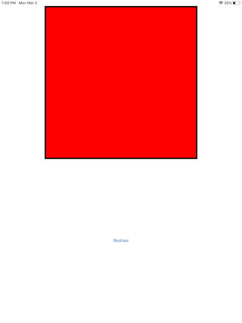
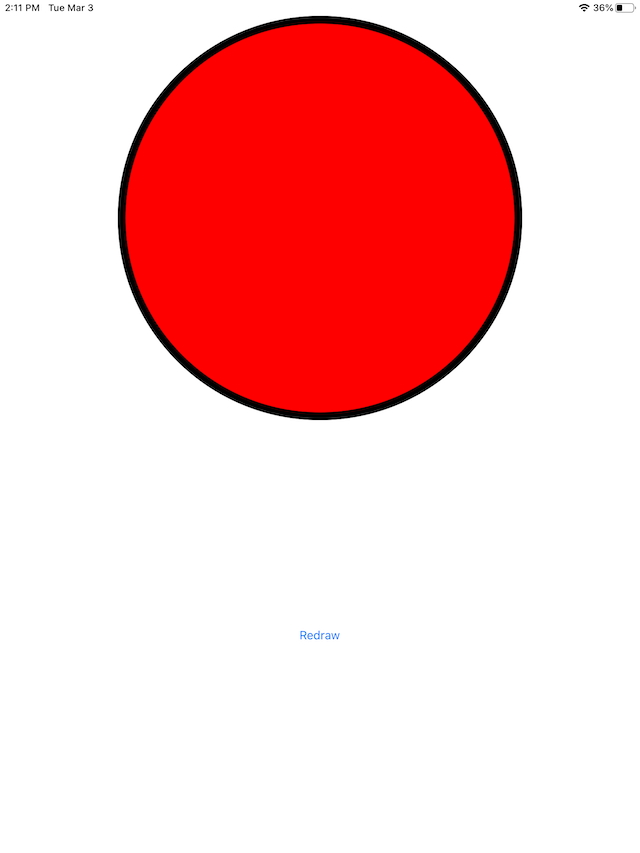
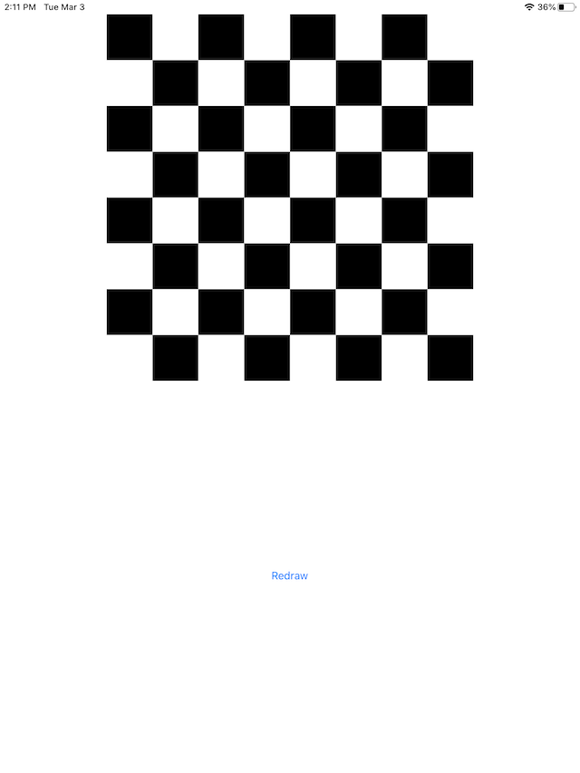
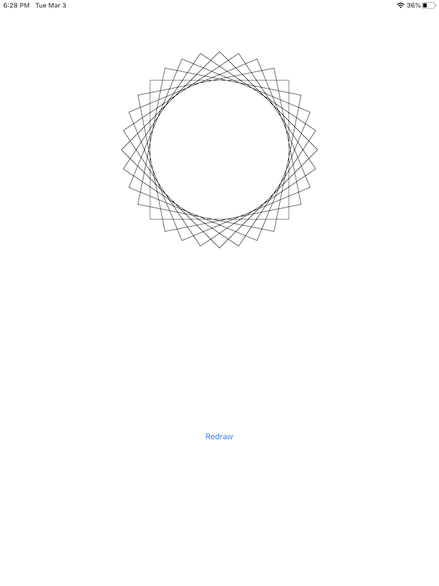
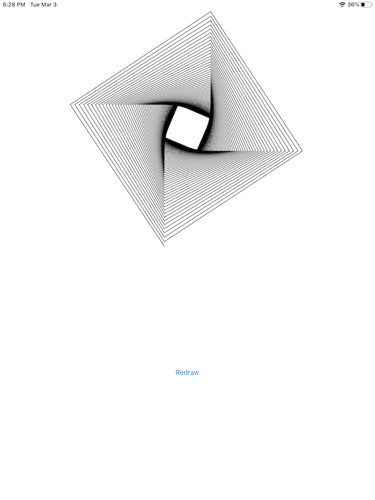

# Core Graphics (UIKit)

## Description
`Core Graphics` is one of the most powerful frameworks that will be helpful to 2D drawing, if you want to create shapes, shadows, colors or so on, you will be looking for `Core Graphics`.

## Tags
This app has been worked through sections, so if you want to see an specific section, you can go through tags to take a look at them.

### setting-up
* Add files for organize repository
    * .gitignore
    * LICENSE
    * README.md
    * .swiftlint.yml
* Adjust project to be iPad only
* Add `Swiftlint`

### creating-the-sandbox
| Screenshot 01 |
| ------------- |
|  |

### drawing-into-a-coregraphics-context
| Screenshot 02 |
| ------------- |
|  |

### ellipses-and-checkerboards
| Screenshot 03 | Screenshot 04 |
| ------------- | ------------- |
|  |  |

### transforms-and-lines
| Screenshot 05 | Screenshot 06 |
| ------------- | ------------- |
|  |  |

### images-and-text
| Screenshot 07 |
| ------------- |
|  |